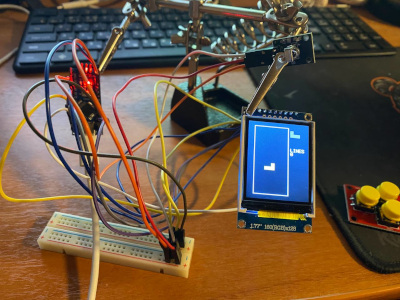

# Arduino Experiments

A progressive series of Arduino sketches exploring display drivers, IR remote control, sound output, and interactive games. Built for Arduino Uno / Nano with common breakout modules.



## Hardware

All projects use one or more of the following components:

| Component | Pins | Used in |
|---|---|---|
| SSD1306 128×64 OLED (I2C) | SDA/A4, SCL/A5 | 00, 01 |
| ST7735S 1.8" TFT (SPI) | CS 10, DC 9, RST 8, MOSI 11, SCK 13 | 02–10 |
| IR Receiver (NEC) | D2 | 03–08 |
| AD Keyboard (resistive divider) | A0 | 09, 10 |
| Piezo Speaker | D4 | 01 |

## Projects

### 00 — Hello World (I2C LED SSD1306)

Minimal SSD1306 OLED test over I2C. Initializes the display at address 0x3C and prints a message — the starting point for the series.

**Hardware:** SSD1306 OLED

### 01 — Music

Plays melodies (Korobeiniki, Mario, Imperial March, USSR Anthem) through a piezo speaker while displaying on the SSD1306 OLED. Notes defined as frequency constants played via `tone()`.

**Hardware:** SSD1306 OLED, Piezo speaker D4, LED D13

### 02 — ST7735S TFT

Basic SPI TFT initialization and rendering test. Sets up the 1.8" ST7735S display in landscape orientation and draws text.

**Hardware:** ST7735S TFT

### 03 — IR Decoder (ST7735S TFT)

Decodes NEC IR remote signals and displays the received protocol, address, and command values on the TFT screen. The foundation for all IR-controlled projects that follow.

**Hardware:** ST7735S TFT, IR Receiver D2

### 04 — IR Ball

A red ball controlled by IR remote directional buttons. Moves a filled circle across the TFT with each button press. Demonstrates real-time IR input handling and basic collision boundaries.

**Hardware:** ST7735S TFT, IR Receiver D2

### 05 — Tic-Tac-Toe

Two-player Tic-Tac-Toe on the TFT. IR remote maps to grid positions (1–9), players alternate placing X and O, win detection triggers a celebration screen. Any button restarts the game.

**Hardware:** ST7735S TFT, IR Receiver D2

### 06 — Snake

Classic Snake game on a 25×32 cell grid (5px per cell). Controlled via IR directional buttons, with wall and self-collision detection, food spawning, score tracking, and game-over restart.

**Hardware:** ST7735S TFT, IR Receiver D2

### 07 — Tetris

Full Tetris implementation on the TFT. Features 7 tetrominoes with 4 rotations each (stored in PROGMEM), 10×20 playfield, gravity-accelerated falling, line clearing with scoring, hard drop, next-piece preview, and auto-restart after game over.

**Hardware:** ST7735S TFT, IR Receiver D2

**Controls:** LEFT/RIGHT move, UP rotates, DOWN hard drops. Game restarts after 5 seconds on game over.

### 08 — Big Tetris (IR)

A larger-scale Tetris with bigger 7px cells on a 10×20 grid. Features 7 tetrominoes stored in PROGMEM, next-piece preview, HUD with line count, progressive speed increase, and title screen.

**Hardware:** ST7735S TFT, IR Receiver D2

**Controls:** LEFT/RIGHT move, UP rotates, DOWN hard drops.

### 09 — Big Tetris (AD Keyboard)

Same Big Tetris gameplay as 08 but controlled via a resistive-divider AD keyboard on A0. Includes software debouncing over 3 ADC samples for reliable input.

**Hardware:** ST7735S TFT, AD Keyboard A0

**Controls:** LEFT/RIGHT move, SELECT rotates, DOWN hard drops.

### 10 — AD Keyboard Calibrator

A calibration tool for the resistive-divider AD keyboard. Displays the raw analog value and identified key (RIGHT, UP, DOWN, LEFT, SELECT) in real time. Use this to determine threshold values for projects 09.

**Hardware:** ST7735S TFT, AD Keyboard A0

## IR Remote Codes

The projects use an NEC IR remote with the following command mapping:

| Button | Code | Function |
|---|---|---|
| RIGHT | 0x5A | Move right |
| LEFT | 0x08 | Move left |
| UP | 0x18 | Move up / Rotate |
| DOWN | 0x52 | Move down / Hard drop |

## Wiring

```
Arduino         SSD1306 OLED      ST7735S TFT      IR Receiver     AD Keyboard    Speaker
------          -------------     ------------      -----------     -----------    -------
5V              VCC               VCC               VCC             VCC            5V
GND             GND               GND               GND             GND            GND
A4 (SDA)        SDA
A5 (SCL)        SCL
A0                                                                    OUT
D10                               CS
D9                                DC
D8                                RST
D11                              MOSI
D13                              SCK
D2                                                  OUT
D4                                                                                  Positive
D13               LED (via resistor)
```

## License

MIT — see [LICENSE](LICENSE).

Copyright (c) 2026 Ilia Prokhorov
